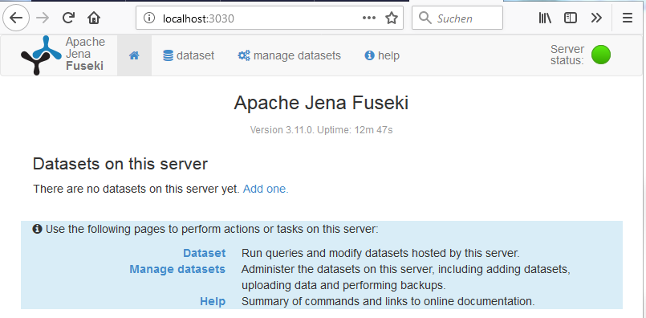
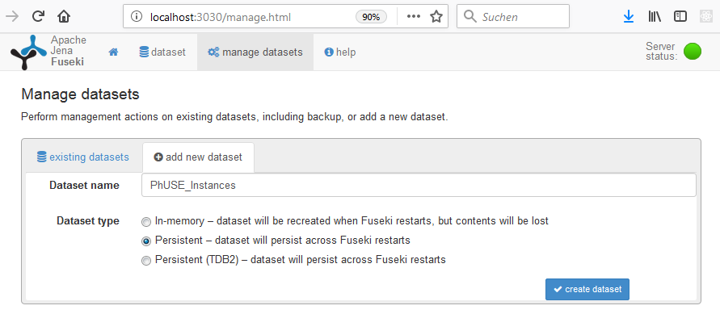
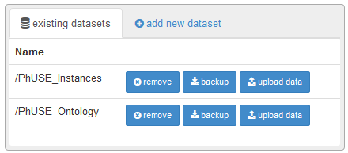
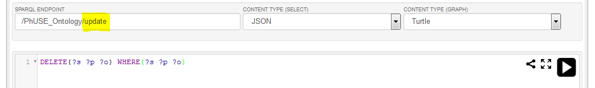

# Local Environment - Apache Jena Fuseki Triple Store

[Go to TOC](TableOfContents.md)

| Date       | Comment       |
| ---------- | ------------- |
| 2019-06-03 | Creation (KG) |


## Background

The project is using Stardog as triple store, which had been available as community version for non-commercial purposes for free. The community version is no longer available. For this alternatives should be provided.

[Apache Jena](https://jena.apache.org/) is a free open source framework for building linked data applications and use this as store. It is easy to setup and use.

## Prerequisite

Only JAVA is required to be installed on the machine. You can check whether JAVA is installed and available in the PATH by using the collowing command (Windows -> enter "CMD" -> press enter -> enter "java --version" in the console -> press enter).

```
java --version
```

## Download and Start Server

* Download "Apache Jena Fuseki" from the [Server](https://jena.apache.org/download/) (e.g. apache-jena-fuseki-3.11.0.zip)
* Unzip file, e.g. in C:\Temp\Programs
* Start the Server
  * Open the command line (Windows -> enter "CMD" -> enter)
  * Change to the unzip directory (cd C:\Temp\Programs\apache-jena-fuseki-3.11.0 -> enter)
  * Start the server (fuseki-server -> enter)
* Open your browser (e.g. Firefox, Chrome)
  * http://localhost:3030/

Now the triple store is running and can be used.



## Setup Database

When there is no dataset available, press the "Add one" on the home screen. Otherwise navigate to "manage datasets" and press "+ add new dataset".



Select a database name, e.g. "PhUSE_Instances" to store and access the CDISC Pilot data instances and "PhUSE_Ontology" the underlying ontologies containing study.ttl and similar. Make sure to select "Persistent" to have the dataset available when restarting the server next time.

## Load instances

After setting the databases, data needs to be included. 



With "upload data", data can be uploaded. The following files from the CTDasRDF repository should be uploaded (https://github.com/phuse-org/CTDasRDF/tree/master/data/rdf).

| Dataset         | File to upload |
| --------------- | -------------- |
| PhUSE_Instances | blub           |
| PhUSE_Ontology  | blob           |

## Remove all triples

In case all triples should be removed, the following SPARQL query can be used:

```
DELETE{?s ?p ?o} WHERE{?s ?p ?o}
```
As this command is not valid for the "query" parameter, the "query" parameter has to be exchanged with "update":

