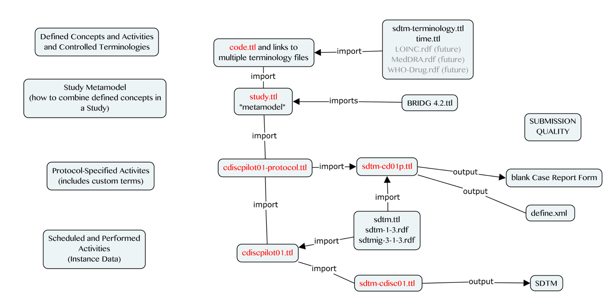

SDTM Data Sources
=================

SDTM XPT data files were copid from the PhUSE CDISCPILOT01 study: <https://github.com/phuse-org/phuse-scripts/blob/master/data/sdtm/cdiscpilot01/> to the project folder /data/source.

Some data augmentation was necessary to test the ontology (see the data conversion process), so recreated data will not be an exact match to the original .XPT. Discrepancies will be noted at a later time.

**DM**, **SUPPDM**, **VS** , and some of **EX** are the initial domains used in the project. This may expand if the project timeline permits.

RDF Files
=========

1.  **study.ttl** (namespace = study: ) The main file. It contains the OWL classes and predicates to represent a single study in RDF. It is a metamodel in the sense that instantiation of study.ttl results in an ontology for a single study. study.ttl is heavily BRIDG-based but not entirely as it attempts to better align with how clinical data are generated and used in health care. study.ttl can be thought of as a generic study schema, not associated with any particular protocol. It can be the starting point for each new study and contains the items needed to derive the blank case report form and contributes to the DEFINE file.

2.  **code.ttl** (namspace = code:) - imported by the study ontology file (study.ttl), code.ttl contains or links to important biomedical concepts that are managed by outside third parties (e.g. CDISC, W3C, and in the future, MedDRA, LOINC, WHO Drug Dictionary, CIMI). All the standard terms needed for the pilot study are contained in code.ttl

3.  **cdiscpilot01-protocol.ttl** imports the study.ttl file and contains protocol-specified activities and rules. Whereas study.ttl describes generic activities and observations in a study, this file describes the specific observations for a particular study and the rules for when to perform them. cdiscpilot01-protocol.ttl includes treatment arm resources and custom analyses. Later development may include the addition of classes like "Protocol-Specified Activity", "Planned Activity", "Scheduled Activity", "Performed Activity", etc.. They are not currently needed for this project and can be derived as owl:Restriction(s) based on the properties of the Activity. For example, a Protocol Specified Activity is any Defined Activity that is associated with a Start Rule; A Planned Activity, is an instance of a Protocol Specified Activity that is associated with a Subject, ....etc. Note: These items are also of importance to the PhUSE "Protocol as RDF" project. May include information like the location of information on the CRF.

4.  **cdiscpilot01.ttl** imports the protocol file above (\#3) and adds instance data for the first 3 subjects in the pilot study. Instance data is manually added to the .ttl file as needed for testing and development. The file **cdiscpilot01-R.ttl** is from first attempts to convert XPT source data using R. It will be replaced with a file from the SMS process: **cdiscpilot01-SMS.ttl** (mapped using SMS, uploaded to Stardog, exported to TTL). The two files are compared to ensure the original hard-coded ontology instance data matches those created by the data conversion process.

5.  To get the data out in a format that we want (e.g. SDTM) we need to link all this information to an SDTM ontology. this is accomplished at the protocol level via the **sdtm-cd01p.ttl** file, from which one can automate the creation of define.xml and eventually the blank case report form.

6.  At the instance level, we take the instance data (cdiscpilot01.ttl) and link it to the sdtm ontology (see sdtm-cdisc01.ttl). This file is used to generate high quality, highly standardized SDTM domains (DM, VS, and SUPPDM) using embedded SPARQL queries (i.e. spin: rules). Note that the instance data file also contains limited exposure information needed to derived certain DM variables (RFXSTDTC and RFXENDTC) although representing full exposure data to generate the EX domain is currently out of scope.

#### Additional Files

-   **sdtm.ttl**
    -   Mini study ontology in RDF/OWL. Variable Name, Label, Role. Used to generate: 1. SDTM domains in the prototype 2. DEFINE XML .
-   **sdtmig-3-1-3.ttl**
    -   SDTM IG version 3.1.3. Used to generate: 1. SDTM domains in the prototype 2. DEFINE XML
-   **sdtm-cdisc01.ttl**
    -   Links cdiscpilot01.ttl with study.ttl for round-tripping the data back to the SDTM standard.
-   **sdtm-cd01p.ttl**
    -   Specific to implmentation of a specific protocol. Used where SDTM provides flexibiity in implementation. Example: Comment for USUBJID: "Concatenation of STUDYID, DM.SITEID and DM.SUBJID" . This is the "protocol-specific SDTM implemntation file." Used in generation of DEFINE XML.

[Back to TOC](TableOfContents.md)
