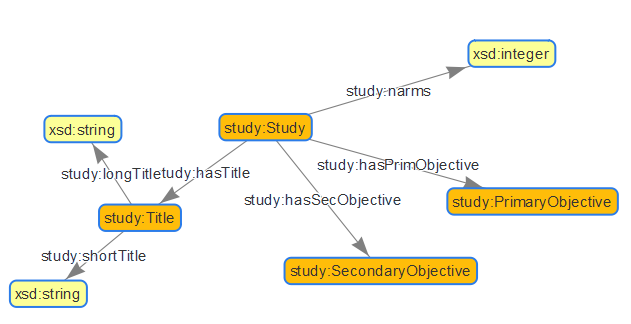
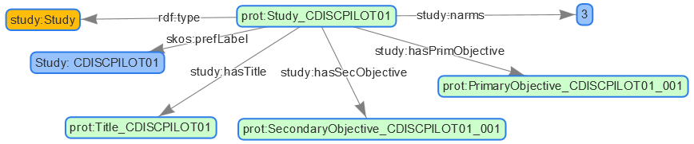
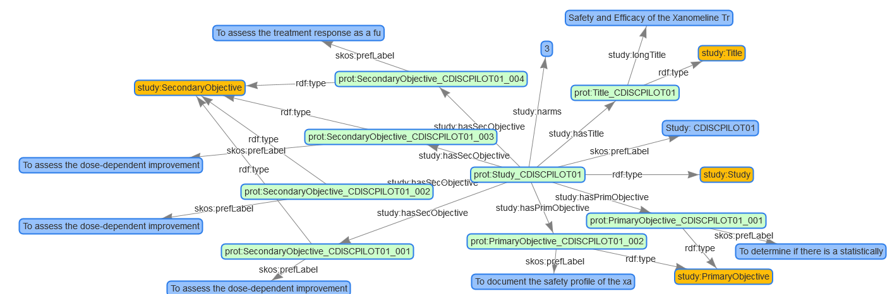
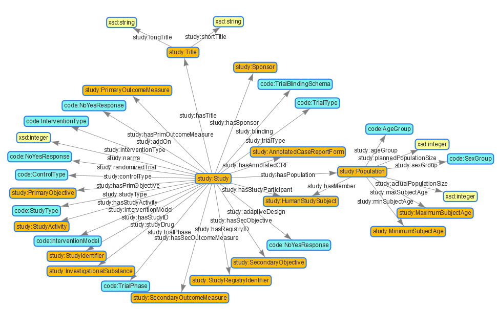
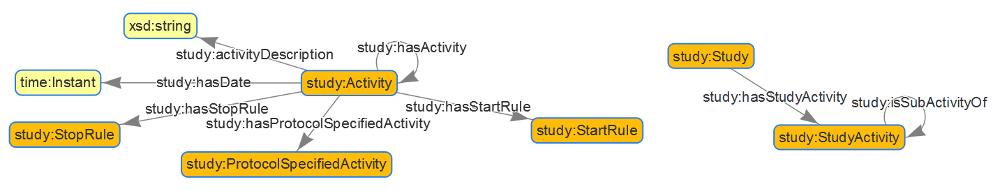
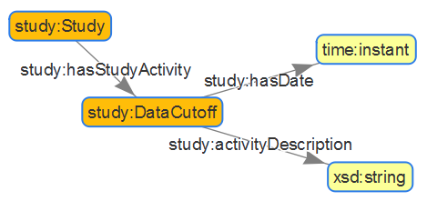

## Remark
THIS IS UNDER DEVELOPMENT, many changes expected.


## Revision

Date         | Comment
------------ | ----------------------------
2018-11-23   | Documentation creation (KG)
2018-11-26   | Further Documentation (KG)


## Overview

To get start with creating triples using an ontology, you might want to perform the following steps:

- Analyze OWL and figure out which object types you need
- Create triples step by step, start with prototyping
- Load more triples and use automation, e.g. use Stardog Mapping Syntax or different programming

In this hands on we use the Trial Summary (TS) as example. The ontology is located mainly in the study.ttl using also other ontology links from the CTDasRDF project.

## Analyze Ontology - concentrate on subset

The more complex an ontology is, the more difficult it is to figure out how the final structure should look like. You can use various ways to browse the ontology provided. In [HandsOnCTDasRDF](https://github.com/phuse-org/CTDasRDF/blob/master/doc/HandsOnCTDasRDF.md) there is a section "Get Hands on Ontologies" where different ways are made available.

You find different HTML files containing a visualization in the r/vis/output folder. To look at them you need to download these files, as somehow the display through github does not work. The following visualizations are available:

Name                            |  Description
-----------------------------   | -----------------
study_ttl_vis.html              | Domain-Range connections of the study.ttl
study_ttl_vis_subclass.html     | Class-SubClass connections of the study.ttl
cdiscpilot01_protocol_ttl.html  | Visualization of the protocol triples, so the instances
sdtm_ttl_first300obs.html       | Part of the Tripples for sdtm.ttl ontology
code_tts_first300obs.html       | Part of the Tripples for code.ttl ontology

In the r/vis subfolder you can also find various program for different visualizations. To get on overview of the related Ontology elements required for the TS mapping, the program r/vis/vis_stardog_dbs.R is used - "create Ontology graph for CTDasRDFOWL (ofInterest_01)".

## Starting small for first experiences

### Setup and start with first instances

Let's concentrate first on a small subset to see how things are working. Checking the Ontology, we currently concentrate only on a few objects:

* study:Study
* skos:prefLabel
* study:narms
* study:hasTitle
* study:Title
* study:longTitle
* study:shortTitle
* study:PrimaryObjective
* study:SecondaryObjective

We are going to start with the "Study" as core element and associate different objects to this. The "Title" object has potentially a longTitle and shortTitle which is a simple string. Then there is the narms (number of arms) as a simple integer assignment and finally we will include a PrimaryObjective and SecondaryObjective.

The Visualization is done throug r/vis/vis_stardog_dbs.R in section "create Ontology graph for CTDasRDFOWL (ofInterest_01)".



Now we need to create the final objects as triples, so a .ttl file. We might want to check the general format to get a feeling by looking into the data/rdf/cdiscpilot01.ttl file. We want to use prefixes to avoid using the complete links for our triples. So we include these into our file:

```
@prefix cd01p: <https://w3id.org/phuse/cd01p#> .
@prefix cdiscpilot01: <https://w3id.org/phuse/cdiscpilot01#> .
@prefix code: <https://w3id.org/phuse/code#> .
@prefix cts: <https://w3id.org/phuse/cts#> .
@prefix custom: <https://w3id.org/phuse/custom#> .
@prefix mms: <https://w3id.org/phuse/mms#> .
@prefix owl: <http://www.w3.org/2002/07/owl#> .
@prefix rdf: <http://www.w3.org/1999/02/22-rdf-syntax-ns#> .
@prefix rdfs: <http://www.w3.org/2000/01/rdf-schema#> .
@prefix sdtmterm: <https://w3id.org/phuse/sdtmterm#> .
@prefix skos: <http://www.w3.org/2004/02/skos/core#> .
@prefix sp: <http://spinrdf.org/sp#> .
@prefix spin: <http://spinrdf.org/spin#> .
@prefix study: <https://w3id.org/phuse/study#> .
@prefix time: <http://www.w3.org/2006/time#> .
@prefix xsd: <http://www.w3.org/2001/XMLSchema#> .
```

Then we need to include the triples. We are going to look first into study:Study. We need to create an instant first. An instant belongs to a namespace, which is the target. We store our triples in the cdiscpilot01.ttl file, so the namespace will be called cdiscpilot01 and have as uri the following which is also used as prefix: "@prefix cdiscpilot01: <https://w3id.org/phuse/cdiscpilot01#>". To make the instant unique, we need a unique name, which will be Study_CDISCPILOT01. To make it clear that this instance has as type the "study:Study" object, we define the "rdf:type" for this instance. Furthermore a prefered Label would be nice, so we include this as well.

Then we can look at the connections for our study instance. It links to one base type - integer - with the "narms" and links to multiple other objects. As each object needs unique names / URIs, we include the study id as postfix. In case multiple objects of the same type are expected, we include additionally a number postfix which is true for the objectives. Actually our study contains multiple primary and secondary objectives. We are going to include the additional ones soon.

We create our first instances the following way using the URIs described:

```
cdiscpilot01:Study_CDISCPILOT01
  rdf:type                            study:Study;
  skos:prefLabel                      "Study: CDISCPILOT01"^^xsd:string ;
  study:narms                         "3"^^xsd:int;
  study:hasTitle                      cdiscpilot01:Title_CDISCPILOT01;
  study:hasPrimObjective              cdiscpilot01:PrimaryObjective_CDISCPILOT01_001;
  study:hasSecObjective               cdiscpilot01:SecondaryObjective_CDISCPILOT01_001;
.
```

To get a visualization, we store the ts_test001.ttl file including the prefix definitions and first instances, upload these triples into a triple store - e.g. the stardog database - and run the visualization.

### Example - Clear DB, Add instances, Run Visualization

Delete all triples from the CTDasRDFSMS database trouth the Stardog Web interface. Open your database <http://localhost:5820/CTDasRDFSMS>. Go to ">_Query" and execute the delete all tripples command: DELETE{?s ?p ?o} WHERE{?s ?p ?o}.

Load the ts_test001.ttl file into the the database through "Data" -> "+Add", choose the corresponding file and click "Upload". You should get a "Success!" message. You can check the success by selecting all triples in the store with the command: SELECT * WHERE {?s  ?p ?o}.

The Visualization is done throug r/vis/vis_stardog_dbs.R in section "create content graph for CTDasRDFSMS".



### Continue with first instances

As a next step we need to define the linked instances further. In our case these are the three for the title, the primary objective and the secondary objective. Out study has just one long Title. Furthermore we should also specify the type of the Title. This we can do with the following triples:

```
cdiscpilot01:Title_CDISCPILOT01
  rdf:type                            study:Title;
  study:longTitle                     "Safety and Efficacy of the Xanomeline Transdermal Therapeutic System (TTS) in Patients with Mild to Moderate Alzheimer’s Disease."^^xsd:string ;
.
```

The objectives does not contain any further connections. They are unique as they are and the content should be included in the prefered label. As we have multiple primary and secondary objectives, we must create for each unique objective a unique instance. We change the definition for our Study_CDISCPILOT01 to include all objectives and furthermore define all single objectives. 


Our final ttl file contains now the following triple definitions additionally to the prefixes:

```
cdiscpilot01:Study_CDISCPILOT01
  rdf:type                            study:Study;
  skos:prefLabel                      "Study: CDISCPILOT01"^^xsd:string ;
  study:narms                         "3"^^xsd:int;
  study:hasTitle                      cdiscpilot01:Title_CDISCPILOT01;
  study:hasPrimObjective              cdiscpilot01:PrimaryObjective_CDISCPILOT01_001;
  study:hasPrimObjective              cdiscpilot01:PrimaryObjective_CDISCPILOT01_002;
  study:hasSecObjective               cdiscpilot01:SecondaryObjective_CDISCPILOT01_001;
  study:hasSecObjective               cdiscpilot01:SecondaryObjective_CDISCPILOT01_002;
  study:hasSecObjective               cdiscpilot01:SecondaryObjective_CDISCPILOT01_003;
  study:hasSecObjective               cdiscpilot01:SecondaryObjective_CDISCPILOT01_004;
.

cdiscpilot01:Title_CDISCPILOT01
  rdf:type                            study:Title;
  study:longTitle                     "Safety and Efficacy of the Xanomeline Transdermal Therapeutic System (TTS) in Patients with Mild to Moderate Alzheimer’s Disease."^^xsd:string ;
.
  
cdiscpilot01:PrimaryObjective_CDISCPILOT01_001
  rdf:type                            study:PrimaryObjective;
  skos:prefLabel										  "To determine if there is a statistically significant relationship between the change in both ADAS-Cog and CIBIC+ scores, and drug dose (0, 50 cm2 [54 mg], and 75 cm2 [81 mg])"^^xsd:string ;
.

cdiscpilot01:PrimaryObjective_CDISCPILOT01_002
  rdf:type                            study:PrimaryObjective;
  skos:prefLabel										  "To document the safety profile of the xanomeline TTS."^^xsd:string ;
.

cdiscpilot01:SecondaryObjective_CDISCPILOT01_001
  rdf:type                            study:SecondaryObjective;
  skos:prefLabel										  "To assess the dose-dependent improvement in behavior. Improved scores on the Revised Neuropsychiatric Inventory (NPI-X) will indicate improvement in these areas."^^xsd:string ;
.

cdiscpilot01:SecondaryObjective_CDISCPILOT01_002
  rdf:type                            study:SecondaryObjective;
  skos:prefLabel										  "To assess the dose-dependent improvements in activities of daily living. Improved scores on the Disability Assessment for Dementia (DAD) will indicate improvement in these areas."^^xsd:string ;
.


cdiscpilot01:SecondaryObjective_CDISCPILOT01_003
  rdf:type                            study:SecondaryObjective;
  skos:prefLabel										  "To assess the dose-dependent improvements in an extended assessment of cognition that integrates attention/concentration tasks. The ADAS-Cog (14) will be used for this assessment."^^xsd:string ;
.


cdiscpilot01:SecondaryObjective_CDISCPILOT01_004
  rdf:type                            study:SecondaryObjective;
  skos:prefLabel										  "To assess the treatment response as a function of Apo E genotype."^^xsd:string ;
.
```

### Visualize first instances

Now we have loaded all information available from the selected ontology parts into our graph database. We can visualize this again through the above described process: delete data, add data, visualize via R. 

The following graphic displays the content (r/vis/vis_stardog_dbs.R - section "create content graph for CTDasRDFSMS"):



Our current database looks already quite crowded. But typically you would not look into the graphic presentations of a database, but look into specific questions. If you want to see all secondary Objectives in the current database, you can perform the following query:

```
SELECT ?SecondaryObjective
WHERE
  { ?s rdf:type study:SecondaryObjective .
    ?s skos:prefLabel ?SecondaryObjective }
```

And will get the following output:

* To assess the dose-dependent improvement in behavior. Improved scores on the Revised Neuropsychiatric Inventory (NPI-X) will indicate improvement in these areas.
* To assess the dose-dependent improvements in activities of daily living. Improved scores on the Disability Assessment for Dementia (DAD) will indicate improvement in these areas.
* To assess the dose-dependent improvements in an extended assessment of cognition that integrates attention/concentration tasks. The ADAS-Cog (14) will be used for this assessment.
* To assess the treatment response as a function of Apo E genotype.

## Complete TS mapping

### Get related ontology elements out of domain-range connections

To continue with the TS mapping from the pilot study we check which ontology elements we need to fill. Quite a lot of the content can simply be mapped when looking into the domain-range connections of the ontology. 

The Visualization is done throug r/vis/vis_stardog_dbs.R in section "create Ontology graph for CTDasRDFOWL (ofInterest_02)".



So we are able to map 65% of all observations after this step in our TS domain and are missing 35% observations which are 17 in numbers. But where to map the other observations? Some might be missing as the ontology is under development, but some are already available, but can only be mapped when considering the sub-class connections.

### Connecting sub-class hierarchies

As the next step we might want to look into the Data Cutoff example. 

TSPARMCD     |   TSPARM 
------------ | ----------------------------
DCUTDESC     | Data Cutoff Description
DCUTDTC      | Data Cutoff Date

Where might this mapping go? When we look into the ontology, for example with Protege, we find a class called "study:DateCutoff". Checking the sub-class hierarchy, we figure out that this is a sub-class of "study:AdministrativeActivity", which is a sub-class of "study:StudyActivity" which is a sub-class of "study:Activity".


According the class hierarchy, the sub-classes have the same attributes like the "parents" and might have further connections. The "study:Activity" class has already the required attributes we find in our TS domain which is study:activityDescription and study:hasDate. Furthermore we see the link from "study:Study" to "study:StudyActivity".




So now we merge all reqiured attributes and sub-class values together to be able to map the two Cutoff values to our graph.


