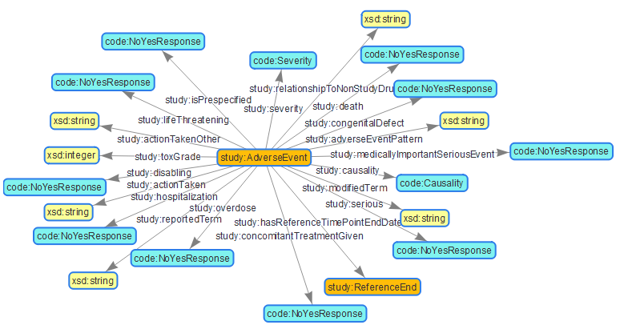
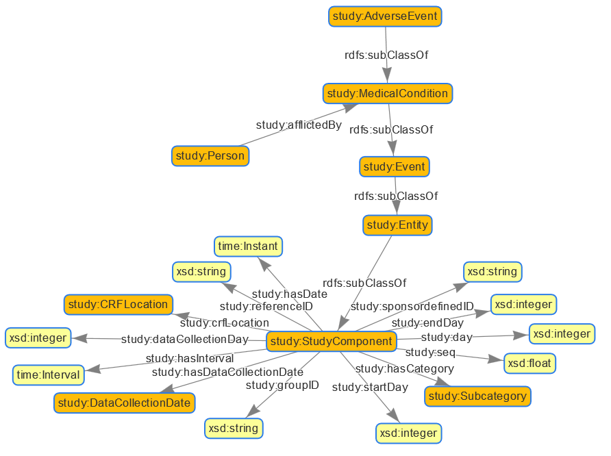

# Hands on Understanding AE

[Go to TOC](TableOfContents.md)

## Revision

| Date       | Comment                     |
| ---------- | --------------------------- |
| 2019-02-25 | Documentation creation (KG) |
| 2019-04-30 | Updates (KG)                |


## Overview

Here we check the current Adverse Event Ontologies, how to investigate this and checkout the instanciation

## Prerequisites

If you want to run the provided SPARQL queries, you need to have the stardog database setup. Create a database called "CTDasRDFOWL" and include all required namespaces.

```
@prefix arg: <http://spinrdf.org/arg#> .
@prefix code: <https://w3id.org/phuse/code#> .
@prefix owl: <http://www.w3.org/2002/07/owl#> .
@prefix rdf: <http://www.w3.org/1999/02/22-rdf-syntax-ns#> .
@prefix rdfs: <http://www.w3.org/2000/01/rdf-schema#> .
@prefix sdtmterm: <https://w3id.org/phuse/sdtmterm#> .
@prefix sh: <http://www.w3.org/ns/shacl#> .
@prefix skos: <http://www.w3.org/2004/02/skos/core#> .
@prefix smf: <http://topbraid.org/sparqlmotionfunctions#> .
@prefix sp: <http://spinrdf.org/sp#> .
@prefix spin: <http://spinrdf.org/spin#> .
@prefix spl: <http://spinrdf.org/spl#> .
@prefix study: <https://w3id.org/phuse/study#> .
@prefix time: <http://www.w3.org/2006/time#> .
@prefix xsd: <http://www.w3.org/2001/XMLSchema#> .
```

Then load the study.ttl file into this database. On the web interface, select the database -> "<_Query" -> Data -> Add. If you made some issues or have old data loaded. You can execute the following query to delete all triples:

```
DELETE{?s ?p ?o} WHERE{?s ?p ?o}
```

Load the pilot content into another dabase called "CTDasRDFSMS" where you load the cdiscpilot01.ttl file.

Additionally looking into the files directly via an editor program like notepad or ultraedit should be done to follow up.

## Checkout Ontology for AdverseEvents

### Direct Connections

The study:AdverseEvent item in the study.ttl described the ontology for Adverse events. There are direct domain-range triples related to this object which can be investigated with the following query:

```
SELECT ?domain ?predicate ?range 
WHERE {
      {BIND(study:AdverseEvent as ?domain)
       ?predicate  rdfs:domain ?domain .
       ?predicate rdfs:range ?range .
      }UNION
      {BIND(study:AdverseEvent as ?range)
       ?predicate  rdfs:domain ?domain .
       ?predicate rdfs:range ?range .
      }
	}
```

We have two separte parts, the first parts checks where the "study:AdverveEvent" is the DOMAIN and the second part checks where it is the RANGE. When looking into the result, it seems the "study:AdverveEvent" only appears as DOMAIN, so only has outgoing attributes.



### Indirect Connections through subClass

Apart from the direct connections, there are additional indirect properties attached which comes through inheritance. SubClass of connections can be investiaged with the following SPARQL for "study:AdverseEvent":

```
SELECT DISTINCT *
	WHERE { BIND(study:AdverseEvent AS ?item)
      		?item rdfs:subClassOf ?mother
            OPTIONAL {?child rdfs:subClassOf ?item}}
```

By exchanging the "item", the complete class hierarchy can be investigated. Alternativly the tool Protege or some other ontology tools can be used to investigate the hierarchy. Finally the following hierarchy is available:

- study:AdverseEvent
- study:MedicalCondition
- study:Event
- study:Entity
- study:StudyComponent

To investigate all potential links to and from "study:AdverveEvent", also the potential links for upper classes has to be considered as options for "study:AdverveEvent".

The complete query to get the following graph is the following:

```
SELECT *
WHERE {{
SELECT DISTINCT *
	WHERE { VALUES ?domain {study:AdverseEvent study:MedicalCondition 
	                        study:Event study:Entity study:StudyComponent}
            BIND (rdfs:subClassOf as ?predicate)
      		?domain rdfs:subClassOf ?range
          }}
UNION {
  SELECT ?domain ?predicate ?range 
	WHERE {
      {VALUES ?domain {study:AdverseEvent study:MedicalCondition 
                       study:Event study:Entity study:StudyComponent}
       ?predicate  rdfs:domain ?domain .
       ?predicate rdfs:range ?range .
      }UNION
      {VALUES ?range {study:AdverseEvent study:MedicalCondition study:Event study:Entity study:StudyComponent}
       ?predicate  rdfs:domain ?domain .
       ?predicate rdfs:range ?range .
      }
	}
  }}
```



There is one incoming link which is the "study:Person" who is afflicted by a "study:MedicalCondition", so also by a "study:AdverseEvent". Important date, sequence and other required information links are available through the basis class "study:StudyComponent" where the "study:AdverseEvent" is also a child of.

### Further connections trough SHACL

Still the main information about the MedDRA code itself is currently still missing. When looking into the study.ttl file and study "study:AdverveEvent", there is some SHACL inside which is currently not covered. As these rules are no direct links and also not attached to a different place in the hierarchy, it has been missed so far. 

The SHACL connection can be retrieved trough the following SPARQL:

```
SELECT ?domain ?predicate ?range WHERE {
 	{?domain  sh:property ?temp .
     ?temp sh:path ?predicate .
     ?temp sh:class ?range
    }}
```


Inclusing these links as well all required Adverse Event information have a location where to go.

### Links available according the ontology

The following attributes are finally available according the current study.ttl ontology. The only "incoming" link to the study:AdverseEvent is coming from study:Person through the "study:afflictedBy" property. All other Attributes are more or less simpyl linked to the Adverse Event object.

| Domain                     | Predicate                            | Range                      |
| -------------------------- | ------------------------------------ | -------------------------- |
| _study:Person_**           | _study:afflictedBy_**                | _study:MedicalCondition_** |
| study:Entity               | rdfs:subClassOf                      | study:StudyComponent       |
| study:AdverseEvent         | rdfs:subClassOf                      | study:MedicalCondition     |
| study:MedicalCondition     | rdfs:subClassOf                      | study:Event                |
| study:Event                | rdfs:subClassOf                      | study:Entity               |
| study:StudyComponent       | study:hasDate                        | time:Instant               |
| study:StudyComponent       | study:startDay                       | xsd:integer                |
| study:StudyComponent       | study:endDay                         | xsd:integer                |
| study:AdverseEvent         | study:causality                      | code:Causality             |
| study:StudyComponent       | study:hasInterval                    | time:Interval              |
| study:AdverseEvent         | study:reportedTerm                   | xsd:string                 |
| study:AdverseEvent         | study:severity                       | code:Severity              |
| study:AdverseEvent         | study:actionTaken                    | xsd:string                 |
| study:AdverseEvent         | study:actionTakenOther               | xsd:string                 |
| study:AdverseEvent         | study:adverseEventPattern            | xsd:string                 |
| study:AdverseEvent         | study:cancer                         | code:NoYesResponse         |
| study:AdverseEvent         | study:concomitantTreatmentGiven      | code:NoYesResponse         |
| study:AdverseEvent         | study:congenitalDefect               | code:NoYesResponse         |
| study:StudyComponent       | study:crfLocation                    | study:CRFLocation          |
| study:StudyComponent       | study:dataCollectionDay              | xsd:integer                |
| study:StudyComponent       | study:day                            | xsd:integer                |
| study:AdverseEvent         | study:death                          | code:NoYesResponse         |
| study:AdverseEvent         | study:disabling                      | code:NoYesResponse         |
| study:StudyComponent       | study:groupID                        | xsd:string                 |
| study:StudyComponent       | study:hasCategory                    | study:Subcategory          |
| study:StudyComponent       | study:hasDataCollectionDate          | study:DataCollectionDate   |
| study:AdverseEvent         | study:hasReferenceTimePointEndDate   | study:ReferenceEnd         |
| study:AdverseEvent         | study:hospitalization                | code:NoYesResponse         |
| study:AdverseEvent         | study:isPrespecified                 | code:NoYesResponse         |
| study:AdverseEvent         | study:lifeThreatening                | code:NoYesResponse         |
| study:AdverseEvent         | study:medicallyImportantSeriousEvent | code:NoYesResponse         |
| study:AdverseEvent         | study:modifiedTerm                   | xsd:string                 |
| study:AdverseEvent         | study:overdose                       | code:NoYesResponse         |
| study:StudyComponent       | study:referenceID                    | xsd:string                 |
| study:AdverseEvent         | study:relationshipToNonStudyDrug     | xsd:string                 |
| study:StudyComponent       | study:seq                            | xsd:float                  |
| study:AdverseEvent         | study:serious                        | code:NoYesResponse         |
| study:StudyComponent       | study:sponsordefinedID               | xsd:string                 |
| study:AdverseEvent         | study:toxGrade                       | xsd:integer                |
| study:AdverseEvent         | code:hasCode                         | meddra:MeddraConcept       |
| study:AdverseEvent         | code:outcome                         | code:AdverseEventOutcome   |
| study:AdverseEvent         | study:causality                      | code:Causality             |
| study:AdverseEvent         | study:hasInterval                    | study:AdverseEventInterval |
| study:AdverseEvent         | study:severity                       | code:Severity              |
| study:AdverseEventInterval | time:hasBeginning                    | study:AdverseEventBegin    |
| study:AdverseEventInterval | time:hasEnd                          | study:AdverseEventEnd      |

## Checkout Instances for AdverseEvents

After the modeling comes the instanciations. So the structure is filled with values and content. This is done in the instances which are available in "cdiscpilot01.ttl".

The following SPARQL query can be used to investigate all triples related to a specific Adverse Event which is instanciated:

```
SELECT * WHERE {
  BIND (cdiscpilot01:AE3_Diarrhoea as ?ae)
  ?ae ?predicate ?object 
}
ORDER BY ?predicate
```

Some of the values are not directly connecteted, but are coded through other objects, like the "No" being coded as "sdtmterm:NoYesResponse_N". Also the MedDRA code is available as "meddra:m10012727". When you look at this URI, you investigate that this has an associated preferred term (meddra:m10012727 -> meddra:hasPT -> meddra:m10012735), which has a label "DIARRHOEA" and so forth.

The following triples are connected to one Adverse Event:

| Adverse Event              | Predicate                            | Object                                      |
| -------------------------- | ------------------------------------ | ------------------------------------------- |
| cdiscpilot01:AE3_Diarrhoea | rdf:type                             | study:AdverseEvent                          |
| cdiscpilot01:AE3_Diarrhoea | skos:prefLabel                       | AE03 Diarrhoea                              |
| cdiscpilot01:AE3_Diarrhoea | code:hasCode                         | meddra:m10012727                            |
| cdiscpilot01:AE3_Diarrhoea | code:outcome                         | code:AEOutcome_RR                           |
| cdiscpilot01:AE3_Diarrhoea | study:actionTaken                    | none                                        |
| cdiscpilot01:AE3_Diarrhoea | study:actionTakenOther               | N/A                                         |
| cdiscpilot01:AE3_Diarrhoea | study:adverseEventPattern            | SINGLE EVENT                                |
| cdiscpilot01:AE3_Diarrhoea | study:cancer                         | sdtmterm:NoYesResponse_N                    |
| cdiscpilot01:AE3_Diarrhoea | study:causality                      | code:Causality_Remote                       |
| cdiscpilot01:AE3_Diarrhoea | study:concomitantTreatmentGiven      | sdtmterm:NoYesResponse_N                    |
| cdiscpilot01:AE3_Diarrhoea | study:congenitalDefect               | sdtmterm:NoYesResponse_N                    |
| cdiscpilot01:AE3_Diarrhoea | study:death                          | sdtmterm:NoYesResponse_N                    |
| cdiscpilot01:AE3_Diarrhoea | study:disabling                      | sdtmterm:NoYesResponse_N                    |
| cdiscpilot01:AE3_Diarrhoea | study:endDay                         | 10                                          |
| cdiscpilot01:AE3_Diarrhoea | study:groupID                        | GRP1                                        |
| cdiscpilot01:AE3_Diarrhoea | study:hasCategory                    | CAT1                                        |
| cdiscpilot01:AE3_Diarrhoea | study:hasDataCollectionDate          | cdiscpilot01:Date_2014-01-16                |
| cdiscpilot01:AE3_Diarrhoea | study:hasInterval                    | cdiscpilot01:Interval_2014-01-09-2014-01-11 |
| cdiscpilot01:AE3_Diarrhoea | study:hasReferenceTimePointEndDate   | cdiscpilot01:Date_2014-01-13                |
| cdiscpilot01:AE3_Diarrhoea | study:hasSubcategory                 | SCAT1                                       |
| cdiscpilot01:AE3_Diarrhoea | study:hospitalization                | sdtmterm:NoYesResponse_N                    |
| cdiscpilot01:AE3_Diarrhoea | study:isPrespecified                 | sdtmterm:NoYesResponse_N                    |
| cdiscpilot01:AE3_Diarrhoea | study:lifeThreatening                | sdtmterm:NoYesResponse_N                    |
| cdiscpilot01:AE3_Diarrhoea | study:medicallyImportantSeriousEvent | sdtmterm:NoYesResponse_N                    |
| cdiscpilot01:AE3_Diarrhoea | study:modifiedTerm                   | DIARRHEA                                    |
| cdiscpilot01:AE3_Diarrhoea | study:overdose                       | sdtmterm:NoYesResponse_N                    |
| cdiscpilot01:AE3_Diarrhoea | study:referenceID                    | REFID3                                      |
| cdiscpilot01:AE3_Diarrhoea | study:relationshipToNonStudyDrug     | NONE                                        |
| cdiscpilot01:AE3_Diarrhoea | study:reportedTerm                   | DIARRHOEA                                   |
| cdiscpilot01:AE3_Diarrhoea | study:seq                            | 3.0                                         |
| cdiscpilot01:AE3_Diarrhoea | study:serious                        | sdtmterm:NoYesResponse_N                    |
| cdiscpilot01:AE3_Diarrhoea | study:severity                       | code:Severity_MILD                          |
| cdiscpilot01:AE3_Diarrhoea | study:sponsordefinedID               | E06                                         |
| cdiscpilot01:AE3_Diarrhoea | study:startDay                       | 8                                           |
| cdiscpilot01:AE3_Diarrhoea | study:toxGrade                       | 1                                           |

The triples are created through the TTL file. This can also be checked out to investigate how the triples are created:

```
cdiscpilot01:AE3_Diarrhoea
  rdf:type study:AdverseEvent ;
  skos:prefLabel "AE03 Diarrhoea" ;
  code:hasCode meddra:m10012727 ;
  code:outcome code:AEOutcome_RR ;
  study:actionTaken "none" ;
  study:actionTakenOther "N/A" ;
  study:adverseEventPattern "SINGLE EVENT" ;
  study:cancer sdtmterm:NoYesResponse_N ;
  study:causality code:Causality_Remote ;
  study:concomitantTreatmentGiven sdtmterm:NoYesResponse_N ;
  study:congenitalDefect sdtmterm:NoYesResponse_N ;
  study:death sdtmterm:NoYesResponse_N ;
  study:disabling sdtmterm:NoYesResponse_N ;
  study:endDay 10 ;
  study:groupID "GRP1" ;
  study:hasCategory "CAT1" ;
  study:hasDataCollectionDate cdiscpilot01:Date_2014-01-16 ;
  study:hasInterval cdiscpilot01:Interval_2014-01-09-2014-01-11 ;
  study:hasReferenceTimePointEndDate cdiscpilot01:Date_2014-01-13 ;
  study:hasSubcategory "SCAT1" ;
  study:hospitalization sdtmterm:NoYesResponse_N ;
  study:isPrespecified sdtmterm:NoYesResponse_N ;
  study:lifeThreatening sdtmterm:NoYesResponse_N ;
  study:medicallyImportantSeriousEvent sdtmterm:NoYesResponse_N ;
  study:modifiedTerm "DIARRHEA" ;
  study:overdose sdtmterm:NoYesResponse_N ;
  study:referenceID "REFID3" ;
  study:relationshipToNonStudyDrug "NONE" ;
  study:reportedTerm "DIARRHOEA" ;
  study:seq "3"^^xsd:float ;
  study:serious sdtmterm:NoYesResponse_N ;
  study:severity code:Severity_MILD ;
  study:sponsordefinedID "E06" ;
  study:startDay 8 ;
  study:toxGrade 1 ;
```