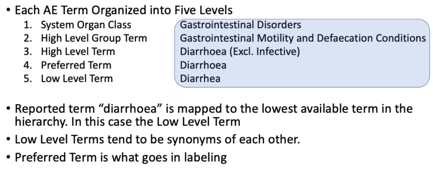
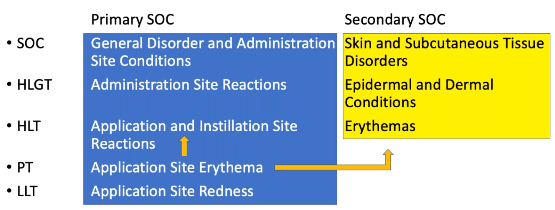
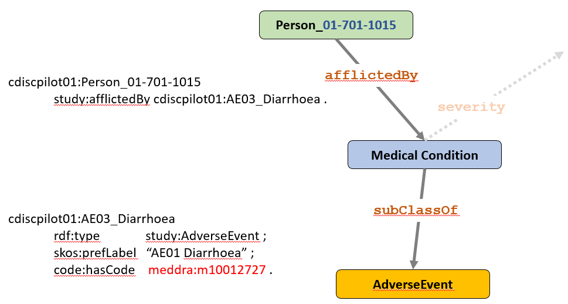
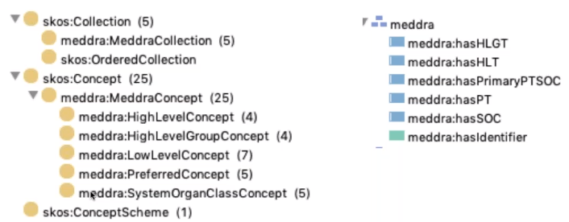
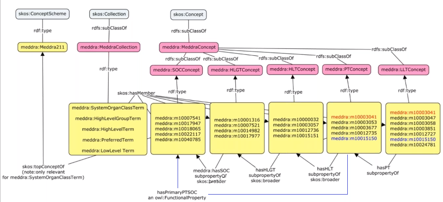
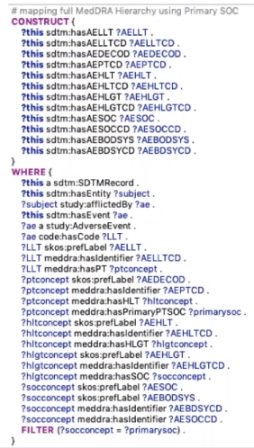
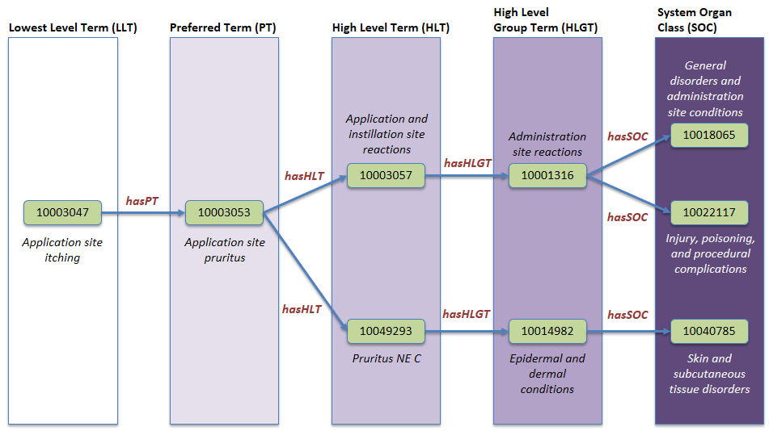
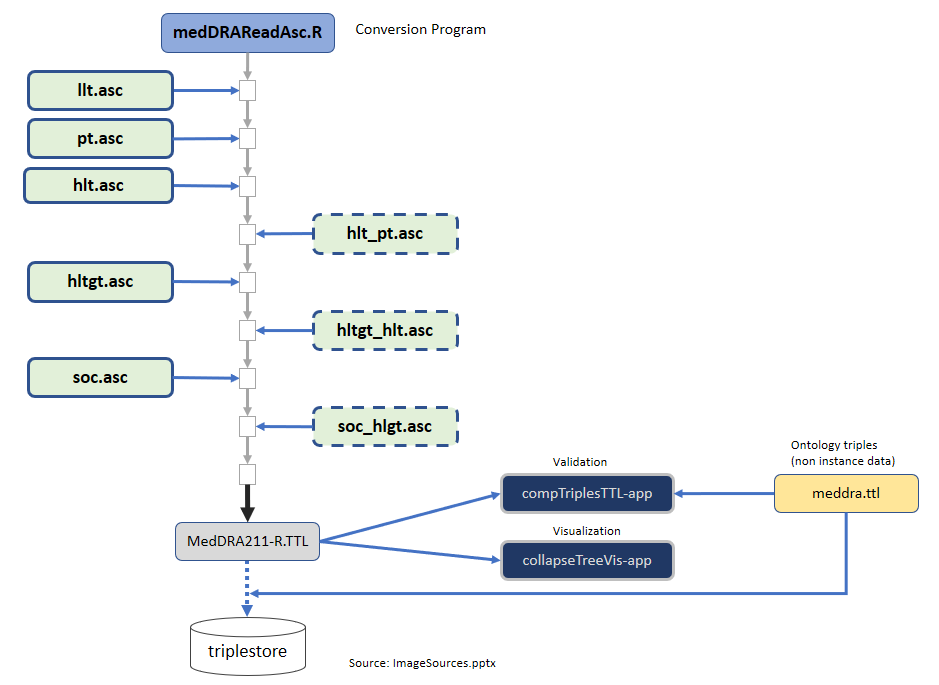

# MedDRA Ontology and Data Conversion

## Introduction

The Medical Dictionary for Regulatory Activitites is a Medical Terminology (Dictionary) and Thesaurus that is 
clinically vaidated and used primarily by the International Conference on Harmonisation (ICH) and its members. It is used to characterize
Adverse Events. The MSSO (Maintenance and Support Services Organization) publishes an updated version twice a year.

In our project, we need to model the Adverse Event data and link it to a representation of MedDRA in RDF.

## MedDRA Terminology Organization

Each AE term is organized into five levels, from the Low Level Term (LLT) which is often the common term documented by the subject or investigator. There may be many synonyms at the Low Level which are then mapped to the Preferred Term (PT). Mapping continue to the High Level Term (HLT), High Level Group Term (HLGT), and System Organ Class (SOC). The thousands of terms map up to 27 SOCs in the current version of MedDRA. 

### Multi-axiality
A term may map to two or more terms at a higher level. In the example below, the PT *Application Site Erythema* maps to two HLT's: *Application and Instillation Site Reactions* and *Erythemas*. This in turn leads to two SOC's in the hierarchy: *General Disorder and Administration site Conditions* and *Skin and Subcutaneous Tissue Disorders* . One of the SOC's is considered the Primary SOC (in this case,  "*General Disorder...") and others are Secondary SOC's. It is common for a single PT to result in mutliple SOC's.

## MedDRA Terminology Distribution
MedDRA is licensed, so source files are not provided as a part of this PhUSE project. We obtained a Research/Non Commercial license from the MSSO in order to perform this work.
The R conversion scripts detailed below can be freely used by anyone to construct the RDF from  licensed copy of terminology files.

### Why RDF for MedDRA Terminology?

* Single File (no merging needed)
* Explicit relationships between terms
* Can include documentation and other metadata

The MSSO maintains no RDF ontology. A number of companies have converted MedDRA to RDF, each using their own process. 

The project will create the scripts needed to convert the terminology to RDF. A subset of that terminology, relevant to the AE's in the project, will be available on the Github site.  The team will share their findings back to the MSSO, who have expressed an interest in MedDRA as RDF.  This is a limited conversion that does not include Standard MedDRA Queries (SMQ's) and is confined to the English representation only.

## Ontology

The object `meddra:m10012727` is the link to the MedDRA terminology in RDF.

### Ontology Structure

Our project created a MedDRA 'mini-ontology' focussed on our use case. It leverages [SKOS](https://www.w3.org/2004/02/skos/) which is well estabilished ontology for terminology. SKOS has three major classes relevant to this effort: 
`skos:ConceptScheme`  - analogous to the name of the dictionary. The dictionary contains Collections.
`skos:Collection`    - logical groupings of concepts. MedDRA has five collections. Collections contain members which are the individual concepts.
`skos:Concept`  - members of a collection which are further divided into subclasses, from Preferrred Concept all the way up to System Organ Class Concept. 

Predicates were defined to express the relationships within the hieararchy, as well as the additionl predicate `meddra:hasPrimaryPTSOC` to link the preferred term to the primary SOC.  

In the diagram below, yellow boxes represent instance data and the pink are classes.  `skos:ConceptScheme` has an instance for the MedDRA version, `meddra:Meddra211` for the version of MedDRA used in this project. `skos:Collection` has the subclass `meddra:Collection` under which there are the five instances for the terminology level (Lowel to SOC).  The `skos:hasMember` predicate links the collection to the individual concepts that make up each collection. The diagram shows only the first nine AE's in the project data. 

It is versy common for a  concept to appear in multiple classes. For example, the LLT `'m10003041` is mapped to itself as a PT (the lower level term *is* the preferred term in this case). 

Under `skos:Concep` we defined `meddra:MeddraConcept` and then further divided the concepts into the five classes of LLTConcept to SOCConcept (pink boxes).  The instances (yellow) are related to the classes by the `rdf:type` predicate. The instance data is linked together using the predicates `hasPT`, '`hasHLT`, etc. With the exception of `hasPT`, these latter predicates are a subproperty of `skos:broader`.

Note the how the predicate `hasPrimaryPTSOC` links with a blue line from a Preferred Term (`PTConcept`) to the `SOCConcept` to identify the Primary SOC. `hasPrimaryPTSOC` has a 1:1 relationship with the `PTConcept` and so is an `owl:FunctionalProperty`.  `hasPT` is expressing the synonym relationship between LLTconcept and PTConcept. 

**TODO: Update the new relation updated after 18MAR for the predicate that replaces `skos:broader` between LLTConcept and PTConcept**

### Instance data
File sdtm-cdisc01.ttl contains instance data that links a subject `cdiscpilot01:Person_01-701-1015` to the adverse event `cdiscpilot01:AE1_AppSiteErythema`. 

## Ontology Conventions

The project uses human-interpretable names for the resources as a way to aid understanding of the ontology and data.
    cdiscpilot01:**Person_01-701-1015**
        study:afflictedBy cdiscpilot01:AE03_**Diarrhoea** .

## Linking to the Subject data
The following SPARQL query inputs the adverse event record from our study instance data. The line `?ae code:hasCode ?LLT1` identifies the low level term for that event. Each higher level term in the hierarchy is queried and extracted. Our SDTM ontology contains this query as a SPIN rule. 

# Data Conversion with R

## Source Files
MedDRA files supplied as ASCII .asc files by the MSSO are serialized to RDF in the Terse Triple Language (TTL) format.

* Five files contain the medication conditions and codes (LLT, PT, HLT, HLGT, SOC)
    * LLT file contains the PT codes to provide the LLT to PT mapping
    * PT file contains the *Primary SOC* code to which the PT term is mapped.
* Three files contain additional mappings evident in their names:  HLT_PT, HLGT_HLT, SOC_HLGT

These files enable mapping of any LLT to its Primary SOC and optionally to Secondary SOC's.

## R Script
The R library `rdflib` is used to serialize the data into RDF. This package is a wrapper around the `redland` package, providing a much cleaner implementation. 

## Validation
TODO: 
1. Add RShiny app validation.
2. Collapsible tree visualization

## Validation

