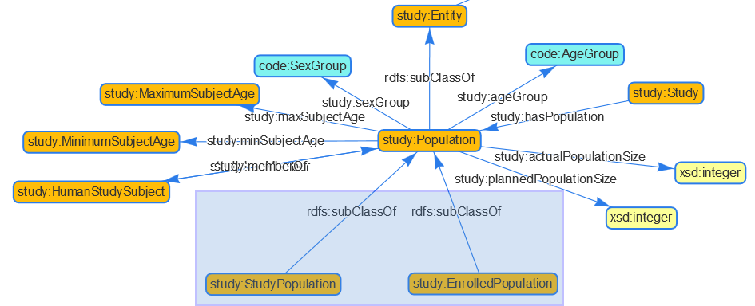

## Purpose

Please ask your questions related to data or ontologies here to get answers from the project. You can simply login to Github and use the "Edit" Button in the top-right action box. Please remove your question when it is answered and you noticed the answer. If a question/answer is relevant to others, the content might go into general documentation.

## SPIN Rules - Get Data Tabular

### Question: How to query a SPIN rule?

SPIN rules, like the one for the [MedDRA extract](https://github.com/phuse-org/MedDRAasRDF/blob/master/doc/images/Meddra-Query.png) are modeled. How can this spin rule query be executed to receive the content? Same we have for domain load, don't we? Or do I have to reconstruct the query and execute this as SPARQL query?

## MedDRA Mapping

### Question: How to deal with quotes in string?

There seems to be three LLT codes having a quote in the label, e.g. Feeling "cool". The R program removes all quotes, so the string would be 'Feeling cool', currently the SAS program uses the masking of \" to mask the quote. Which way should we go?

## Protocol Population - Ontology / Instantiation

### Question: child attibutes located at mother - intended or to-change?

As we have two childs of study:Population (study:StudyPopulation & study:EnrolledPopulation), should we have all attributes on the "mother", even though these might only be applicable for one of the childs and not all, e.g. plannedPopulation Size?



### Question: Population attributes in Instances, but not in Ontology - need for change?

In the instances, we map from study:StudyPopulation through study:hasSite and study:healthySubject. According study.ttl this is not a valid route as the population is no 

Instances cdiscpilot01-protocol.ttl:

```
cd01p:StudyPopulation_CDISCPILOT01
  rdf:type study:StudyPopulation ;
  skos:prefLabel "Study population CDISCPILOT01" ;
  study:ageGroup code:AgeGroup_ADULT ;
  study:ageGroup code:AgeGroup_ELDERLY ;
  study:hasSite cd01p:Site_701 ;
  study:healthySubject sdtmterm:NoYesResponse_N ;
  study:maxSubjectAge <https://w3id.org/phuse/code#PlannedSubjectAge_NULL.PINF> ;
  study:minSubjectAge code:PlannedSubjectAge_P50Y ;
  study:sexGroup sdtmterm:SexGroup_BOTH ;
.
```

Ontology study.ttl:

```
study:hasSite
  rdf:type owl:ObjectProperty ;
  rdfs:comment "" ;
  rdfs:domain study:Party ;
  rdfs:range study:Site ;
  skos:definition "The organization (e.g. hospital, clinic) where a Human Study Subject goes to participate in many Study Activities." ;
  skos:prefLabel "has Site" ;
.

study:healthySubject
  rdf:type owl:ObjectProperty ;
  rdfs:domain study:Party ;
  rdfs:range code:NoYesResponse ;
  skos:prefLabel "healthy subject" ;
.
```