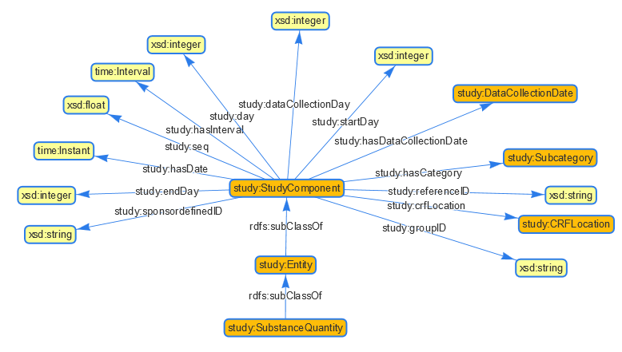
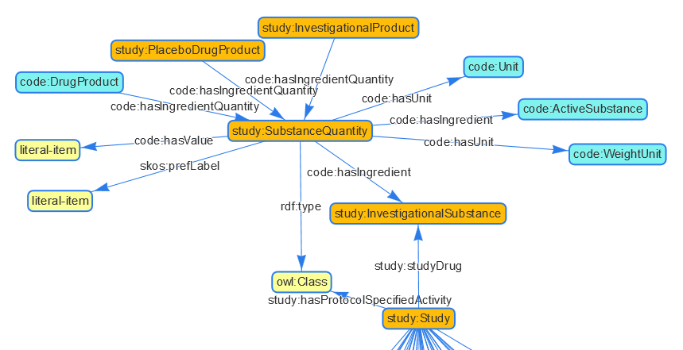

## Purpose

Please ask your questions related to data or ontologies here to get answers from the project. You can simply login to Github and use the "Edit" Button in the top-right action box. Please remove your question when it is answered and you noticed the answer. If a question/answer is relevant to others, the content might go into general documentation.

## SPIN Rules - Get Data Tabular

### Question: How to query a SPIN rule?

SPIN rules, like the one for the [MedDRA extract](https://github.com/phuse-org/CTDasRDF/blob/master/doc/images/Meddra-Query.png) are modeled. How can this spin rule query be executed to receive the content? Same we have for domain load, don't we? Or do I have to reconstruct the query and execute this as SPARQL query?

## MedDRA Mapping

### Question: How to deal with quotes in string?

There seems to be three LLT codes having a quote in the label, e.g. Feeling "cool". The R program removes all quotes, so the string would be 'Feeling cool', currently the SAS program uses the masking of \" to mask the quote. Which way should we go?

## Protocol Drug&Dosage - Ontology / Instantiation

### Question: Can you please check the Ontology / Instances?

It seems the ontology does not fit the instances in "cdiscpilot01-protocol.ttl".

According "study.ttl" there are some major proerties and connections missing for study:SubstanceQuantity.



```
study:SubstanceQuantity
  rdf:type owl:Class ;
  rdfs:subClassOf study:Entity ;
  skos:prefLabel "Substance quantity" ;
```

In the instances the dosage information are available through study:SubstanceQuantity in "cdiscpilot01-protocol.ttl".



```
cd01p:SubstanceQuantity_1
  rdf:type code:SubstanceQuantity ;
  rdf:type study:SubstanceQuantity ;
  skos:prefLabel "Substance quantity 1" ;
  code:hasIngredient code:Substance_Xanomeline ;
  code:hasUnit code:Unit_mg ;
  code:hasValue 0 ;
```